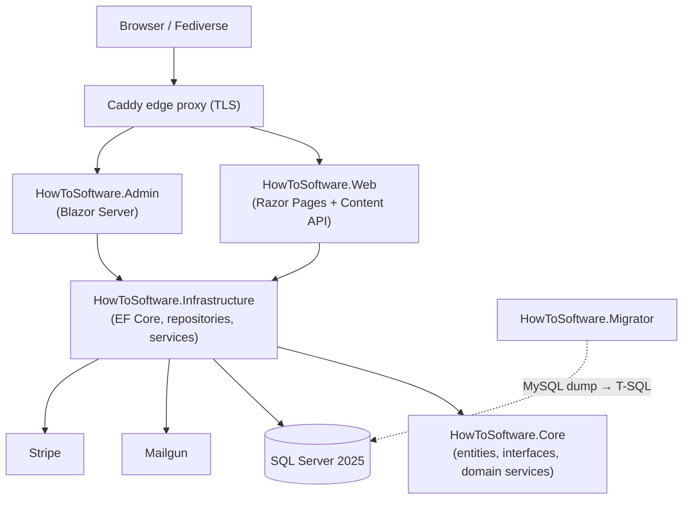

# HowToSoftware

> A from-scratch **ASP.NET Core 10** reimplementation of the Ghost publishing
> platform — feature-matched to [howtoosoftware.com](https://howtoosoftware.com)
> and running on SQL Server 2025 in Docker.

[](https://dotnet.microsoft.com/)
[](https://learn.microsoft.com/dotnet/csharp/)
[](https://www.microsoft.com/sql-server)
[](#project-status)

---

## Overview

**HowToSoftware** replaces a self-hosted **Ghost 6.x** instance (Node.js + MySQL)
with a purpose-built, C#-first publishing platform. It reproduces the parts of
Ghost that the site actually relies on — content, memberships, paid
subscriptions, newsletters, comments, analytics, and ActivityPub federation —
while giving the team a codebase they own end to end.

The database schema is a direct port of Ghost's data model (**95 tables** across
the Ghost and ActivityPub databases) into T-SQL, and a dedicated migrator
converts existing Ghost MySQL dumps — posts, members, settings, images, and
analytics — into the new SQL Server database with rendered-HTML verification.

For the full rationale, technology mapping, and schema, see
[docs/CLONE-ARCHITECTURE.md](docs/CLONE-ARCHITECTURE.md).

## Features

**Publishing & content**
- Posts, pages, tags, collections, and revisions with Ghost-style routing and pagination
- Custom **Lexical** and legacy **Mobiledoc** renderers (JSON → sanitized HTML), plus a Mobiledoc→Lexical converter
- Reusable snippets, slug generation, and HTML sanitization
- Full-text search and RSS/newsletter archive feeds

**Members & commerce**
- ASP.NET Identity with passwordless **magic-link** sign-in
- Stripe-backed paid subscriptions, tiers/products, offers, and one-off donations
- Member labels, segments, notes, activity timeline, CSV import, and staff impersonation
- Tiered content gating (free / members / paid)

**Email & newsletters**
- Newsletter sending via **MailKit → Mailgun** with batched delivery
- Automated emails, drip sequences, and **A/B subject-line** testing with holdout resolution
- Suppression list and spam-complaint handling

**Community & discovery**
- Threaded comments with likes and reports
- **ActivityPub** federation (accounts, follows, likes, reposts, notifications, outbox)
- Webmentions/mentions, recommendations, redirects, IndexNow, and outbound webhooks

**Analytics & operations**
- Privacy-friendly first-party analytics with hourly/daily rollups
- Real-time live-visitor count and recent pageviews over **SignalR**
- GeoIP country lookup (MaxMind/DB-IP), brute-force protection, admin audit log, and per-endpoint rate limiting

**APIs & migration**
- Ghost-compatible **Content API** (REST) with API-key authentication
- Ghost import/export plus a standalone MySQL → SQL Server migration tool

## Architecture

The solution follows a clean, layered design. `Core` holds the domain with no
external dependencies; `Infrastructure` implements persistence and integrations;
`Web` and `Admin` are the two host applications.



| Project | Responsibility |
|---|---|
| [HowToSoftware.Core](src/HowToSoftware.Core) | Domain entities, service interfaces, and framework-free logic (content rendering, slugs, sanitization) |
| [HowToSoftware.Infrastructure](src/HowToSoftware.Infrastructure) | EF Core `AppDbContext`, repositories, external integrations (Mailgun, Stripe, GeoIP, image storage), health checks, DI wiring |
| [HowToSoftware.Web](src/HowToSoftware.Web) | Public website — Razor Pages, Content API, member cookie auth, rate limiting |
| [HowToSoftware.Admin](src/HowToSoftware.Admin) | Blazor Server admin panel — staff login, real-time analytics, email/analytics background services |
| [HowToSoftware.Migrator](src/HowToSoftware.Migrator) | CLI that converts Ghost MySQL dumps to T-SQL, migrates images, and verifies rendered output |

## Tech stack

| Layer | Technology |
|---|---|
| Runtime | .NET 10 / C# 14 |
| Public site | ASP.NET Core 10 (Razor Pages + Web API) |
| Admin panel | Blazor Server (interactive) |
| Database | SQL Server 2025 (T-SQL) |
| ORM | Entity Framework Core 10 |
| Auth | ASP.NET Identity + magic-link tokens (Ghost bcrypt → PBKDF2 migration) |
| Email | MailKit → Mailgun |
| Payments | Stripe.net |
| Real-time | SignalR |
| Content | Lexical.js editor · custom Lexical/Mobiledoc renderers · HtmlSanitizer · ImageSharp |
| Containers | Docker / Docker Compose |
| Edge proxy | Caddy 2 |

## Quick Start

### Prerequisites

- [.NET 10 SDK](https://dotnet.microsoft.com/download)
- SQL Server 2025 (local instance, LocalDB, or the SQL Server container)
- [Docker Desktop](https://www.docker.com/products/docker-desktop/) — required for the full stack and for integration tests (Testcontainers)
- Node.js 20+ — optional, only for rebuilding front-end/theme assets with Vite

### 1. Clone

```powershell
git clone <your-remote-url> howtoosoftware-rework
cd howtoosoftware-rework
```

### 2. Configure secrets

Connection strings and provider keys are read from configuration. For local
development, use **User Secrets** rather than committing values:

```powershell
# From src/HowToSoftware.Web
dotnet user-secrets set "ConnectionStrings:DefaultConnection" "Server=localhost;Database=HowToSoftware;Trusted_Connection=True;TrustServerCertificate=True;"
dotnet user-secrets set "Mail:MailgunDomain" "mg.example.com"
dotnet user-secrets set "Mail:MailgunApiKey" "<key>"
dotnet user-secrets set "Stripe:SecretKey" "<key>"
```

The default connection string in [appsettings.json](src/HowToSoftware.Web/appsettings.json)
points at `localhost` with integrated auth, so a local SQL Server may need no
extra configuration.

### 3. Create the database

Restore the schema using the migrator (recommended, as it also imports Ghost
content) or apply the SQL scripts in the repository root:

```powershell
# Generate a T-SQL script from a Ghost dump and run it, or execute directly:
dotnet run --project src/HowToSoftware.Migrator -- docs/ghost_posts_dump.sql --execute -c "Server=localhost;Database=HowToSoftware;Trusted_Connection=True;TrustServerCertificate=True;"
```

### 4. Run

```powershell
# Public website  → http://localhost:5032
dotnet run --project src/HowToSoftware.Web

# Admin panel     → http://localhost:5105
dotnet run --project src/HowToSoftware.Admin
```

## Running with Docker

The Compose stack builds both host apps behind an external SQL Server, with TLS
terminated by the edge Caddy proxy.

```powershell
# Development stack (web on :80, admin on :5001)
docker compose up --build

# Production configuration (health checks, resource limits, read-only fs)
docker compose -f docker-compose.yml -f docker-compose.prod.yml up -d --build
```

Compose reads secrets from a `.env` file (`DB_HOST`, `DB_PASSWORD`, `SITE_URL`,
`MAILGUN_DOMAIN`, `MAILGUN_API_KEY`). To deploy to a remote host over SSH, use
[scripts/deploy.ps1](scripts/deploy.ps1), which packages the source, uploads it,
provisions `.env` interactively, and runs Compose.

## Project layout

```
src/
  HowToSoftware.Core/            # Domain: entities, interfaces, services
  HowToSoftware.Infrastructure/  # EF Core, repositories, integrations, DI
  HowToSoftware.Web/             # Public site (Razor Pages + Content API)
  HowToSoftware.Admin/           # Blazor Server admin panel
  HowToSoftware.Migrator/        # Ghost MySQL → SQL Server migration CLI
tests/                           # xUnit test project per src project
deploy/                          # Dockerfiles, Caddyfile, GeoIP database
scripts/                         # Deployment and operational scripts
docs/                            # Architecture, schema, cutover, and data dumps
ref/                             # Original Ghost theme being ported
```

## Testing

Each source project has a matching xUnit test project. Integration tests use
`Testcontainers.MsSql`, and Blazor components are covered with bUnit — so Docker
must be running for the full suite.

```powershell
dotnet test
```

## Migrating from Ghost

The migrator parses Ghost MySQL dumps and produces (or executes) an equivalent
T-SQL script, rewriting `__GHOST_URL__` references and optionally copying images.

```powershell
# Generate a script
dotnet run --project src/HowToSoftware.Migrator -- docs/ghost_posts_dump.sql -o migration.sql

# Execute directly against SQL Server
dotnet run --project src/HowToSoftware.Migrator -- docs/ghost_posts_dump.sql --execute -c "<connection-string>"

# Verify: compare Ghost HTML against clone-rendered HTML for every post/page
dotnet run --project src/HowToSoftware.Migrator -- docs/ghost_posts_dump.sql --verify --site-url https://howtoosoftware.com
```

See [BUILD.md](BUILD.md) for the complete Ghost-to-T-SQL table mapping.

## Documentation

| Document | Description |
|---|---|
| [BUILD.md](BUILD.md) | Build plan, phase tracker, and the full 95-table Ghost → T-SQL mapping |
| [docs/CLONE-ARCHITECTURE.md](docs/CLONE-ARCHITECTURE.md) | Solution structure, technology mapping, T-SQL schema, and Compose details |
| [docs/GHOST-DEPLOYMENT-DATA.md](docs/GHOST-DEPLOYMENT-DATA.md) | Extraction of the running Ghost instance (config, content, settings) |
| [docs/DNS-CUTOVER.md](docs/DNS-CUTOVER.md) | DNS cutover runbook — pre-checks, cutover, SSL verification, rollback |
| [docs/OLLAMA_SETUP.md](docs/OLLAMA_SETUP.md) | Local LLM (Ollama) setup for development tooling |
| [ref/howtoosoftware-custom/SECURITY-ARCHITECTURE.md](ref/howtoosoftware-custom/SECURITY-ARCHITECTURE.md) | Security architecture of the original stack |
| [ref/howtoosoftware-custom/](ref/howtoosoftware-custom/) | Original Ghost theme (Handlebars templates, CSS, JS) being ported |

Raw data exports referenced by the migrator live alongside the schema in
[docs/ghost_schema.sql](docs/ghost_schema.sql) and the accompanying `ghost_*_dump.sql` files.

## Security

- All rendered content passes through HTML sanitization; database access uses
  parameterized queries via EF Core.
- Public endpoints are protected by per-IP and per-key sliding-window rate limits,
  and staff/admin actions are recorded in an audit log.
- Report vulnerabilities privately to the maintainers rather than opening a public
  issue. See [ref/howtoosoftware-custom/SECURITY-ARCHITECTURE.md](ref/howtoosoftware-custom/SECURITY-ARCHITECTURE.md)
  for background on the original stack's threat model.

## Contributing

1. Create a feature branch from `main`.
2. Keep changes focused and covered by tests (`dotnet test`).
3. Ensure the solution builds warning-free in Release (`dotnet build -c Release`);
   warnings are treated as errors.
4. Open a pull request describing the change and its rationale.

## Project status

Under active development. Core publishing, membership, email, analytics, and
federation features are in place; testing and CI/CD hardening are ongoing — see
[BUILD.md](BUILD.md) for the live task tracker.

## License

No license file is present in this repository yet. Until a `LICENSE` is added,
all rights are reserved by the project maintainers.
